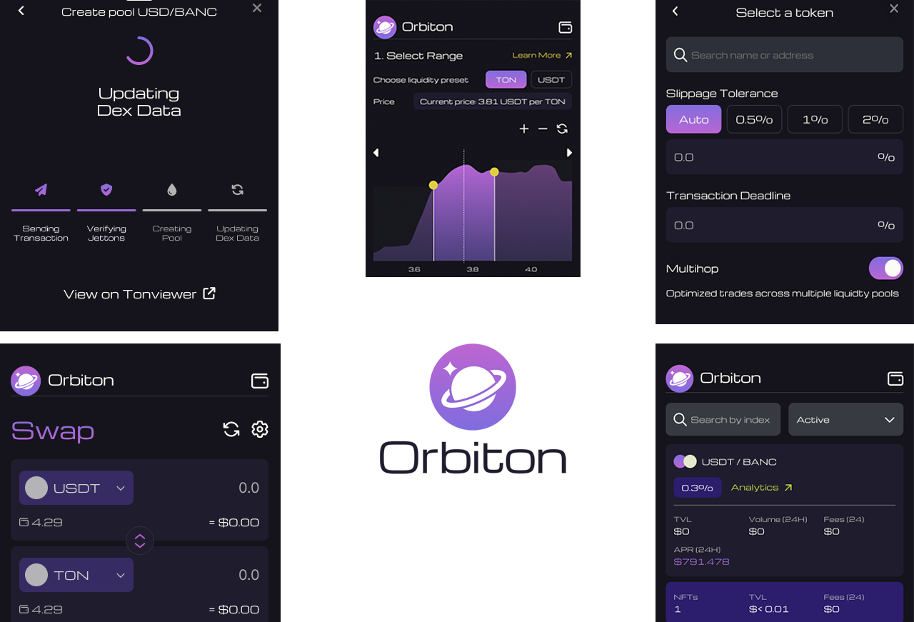

# 💹 Using Orbiton on Telegram

<figure><figcaption>
Better, faster DeFi with Orbiton
</figcaption></figure>

## Step 1: Start Trading on Orbiton

After your wallet is connected, you can start using Orbiton to trade on the TON blockchain. Here’s how to get started:

1. **Explore the DEX**:
   * You can now browse available trading pairs, check out your balances, and explore the various features of the Orbiton.
2. **Deposit Funds**:
   * If you need to deposit $TON or other tokens, you can initiate a deposit within the Orbiton bot by selecting a **“Deposit”** or **“Fund”** option. Follow the instructions provided to send tokens from your TON Wallet to Orbiton’s liquidity pools.
3. **Start Trading**:
   * To place a trade, select **“Trade”** within the Orbiton interface. You’ll be prompted to choose a trading pair (e.g., TON/USDT).
   * Enter the amount of TON or other tokens you want to trade, and follow the instructions to confirm and execute the trade.
4. **Withdraw Tokens**:
   * When you want to withdraw your assets, you can select **“Withdraw”** from the bot menu and follow the instructions to send tokens back to your TON Wallet.

***

## Step 2: Manage Your Wallet and Trades

Once you’re connected, you can:

* **Check balances**: View your current balances of TON and other tokens directly from Orbiton.
* **Monitor transactions**: Keep track of your trades and deposits in real-time.
* **Secure your account**: Ensure that your wallet and Telegram account are secure. Enable **two-factor authentication (2FA)** for additional security on Telegram and other platforms.

***

## Step 3: Disconnecting or Changing Wallets

If at any point you want to disconnect your wallet or change it, simply type **“Disconnect”** or **“Change Wallet”** within the Orbiton bot. This will unlink your current wallet, allowing you to reconnect with a different one if needed.
